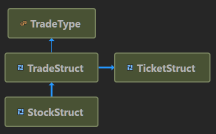

### Introduction

Before C# 7.2 and .net core 2.1, you could improve .net performance with a good dose of conscious effort and relying on code that would not necessarily be nice to look at (and certainly maintainable). Microsoft made several improvements to make sure that you could design & write faster code, not at the sake of the good practices.

#### Struct, struct and more struct!

It is important to get rid of this reflex of choosing the `class` keyword every time you design a new type.

Question yourself about if object-oriented programming is really necessary or if you should use another paradigm that would be more data driven.

Using `struct` have game changing advantages: **You don't directly allocate on the heap, so you're not using the GC** (not directly though).

You can design a memory friendly layout for your type, avoiding many memory indirections that would increase the chances of cache miss!

Before C# 7.2, relying on `struct` were not necessarily a performance win, the reason was that each time you passed/return a `struct` based object: **a copy would be made**, on the stack, but still a copy is a copy: it takes time!

It is now possible to pass/return `struct` based objects using reference to the initial object: avoiding an unnecessary and costly copy.

Two know languages keywords `ref` and `in` enable many new patterns to speed things up!

Relying on `struct` will also enable a linear memory layout for your data, making things way more CPU cache friendly.

Let's take an example:

```csharp
public class A
{
    public int val1;
    public int val2;
}
 
public class B
{
    public float f1;
    public float f2;
 
    public A a1 = new A();   // Point to another object: another memory location
    public A a2 = new A();   // Same here
}

// Allocate an array of 256 pointers to 256 distinct instances of B
var data = new B[256];
```

`data` is one object allocated on the heap (GC), it references 256 instances of `B`, each also allocated on the heap. Each instance of `B` references two instances of `A`, also on the heap.

So we have a total of 1 + 256 + 2*256 objects allocate on the heap: 769 objects, each located somewhere in the memory, that will be eventually garbage collected when no longer needed.

Things to note:

1. You stress your GC. It could be fine if the life time of all these objects is big, close to static. But if you're doing some high frequency code and you allocate `data` hundred, thousand of time per second: it will have an impact on performances.
2. Let's pretend you want to access all fields (direct and indirect) for `data[0]` and `data[1]`. You will have to fetch 7 separate memory locations (the `data` array, `data[0]`, `data[0].a1`, `data[0].a2`, `data[1]`, `data[1].a1`, `data[1].a2`).

Let's make the following changes: we no longer use `class`, but `struct` instead.

```csharp
public struct A
{
    public int val1;
    public int val2;
}
 
public struct B         // Size of the type: 24 bytes
{
    public float f1;    // Offset 0
    public float f2;    // Offset 4
 
    public A a1;        // Offset 8
    public A a2;        // Offset 16
}

// One single memory block of 256 * 24 bytes
var data = new B[256];
```

Ok, this is a naive explanation, internally .net will make things a bit different, but you get the point:

* We now have **1** object allocated on the heap (`data`), which allocates **a continuous memory surface block** to sequentially store all instances of `B`.
* `B` no longer reference other objects: the `a1` and `a2` fields are **part of `B`**, not referenced by `B`.

A `foreach` on the `class` version with access to all the fields would have lead to deal with 769 distinct memory locations, with a CPU that would have hard time to prefetch to reduce the time to access the data.

A `foreach` on the `struct` version with access to all the fields would be as fast as it could be: there's one memory block, the CPU understand pretty quickly that we're **sequentially** accessing the data, so the prefetch and cache loads are very efficient, because everything was design for this!


